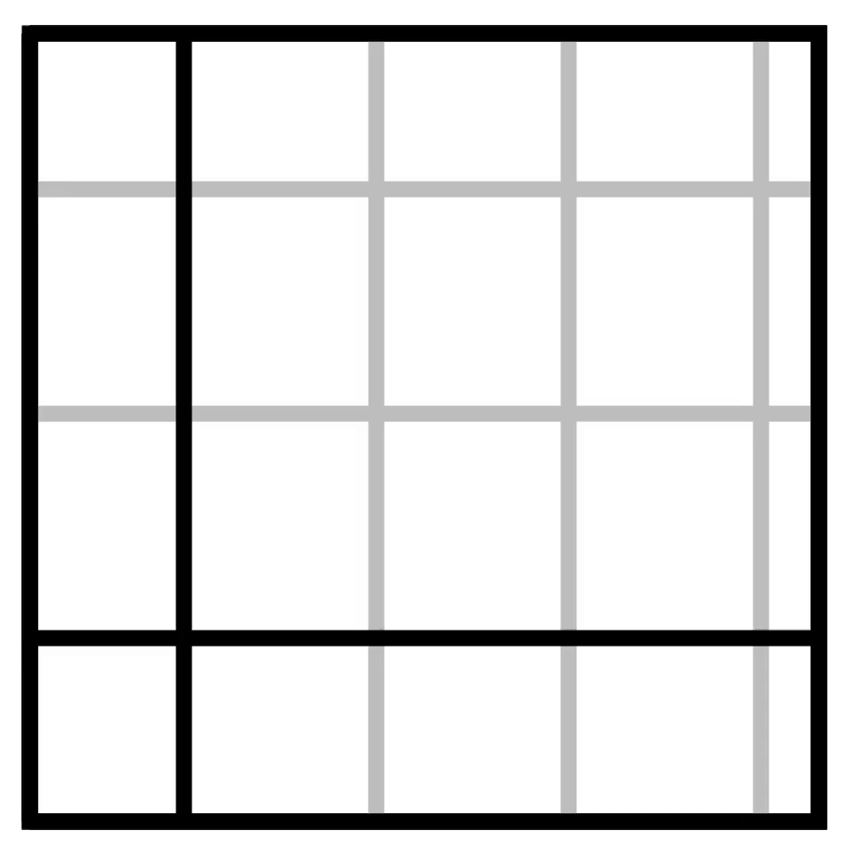
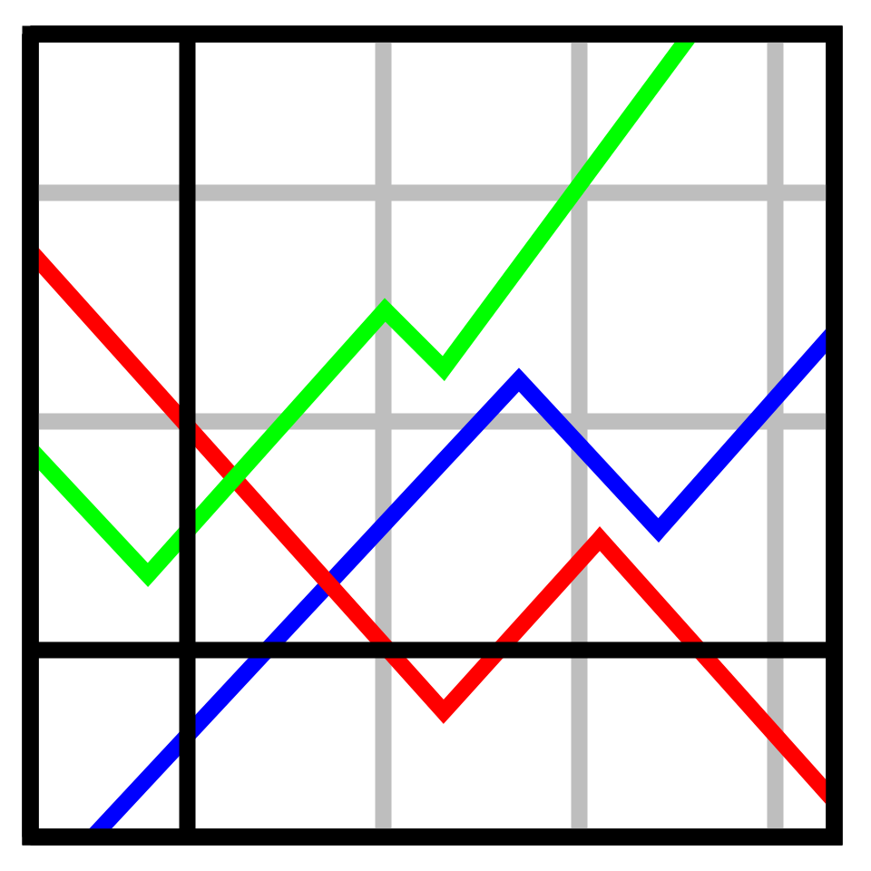
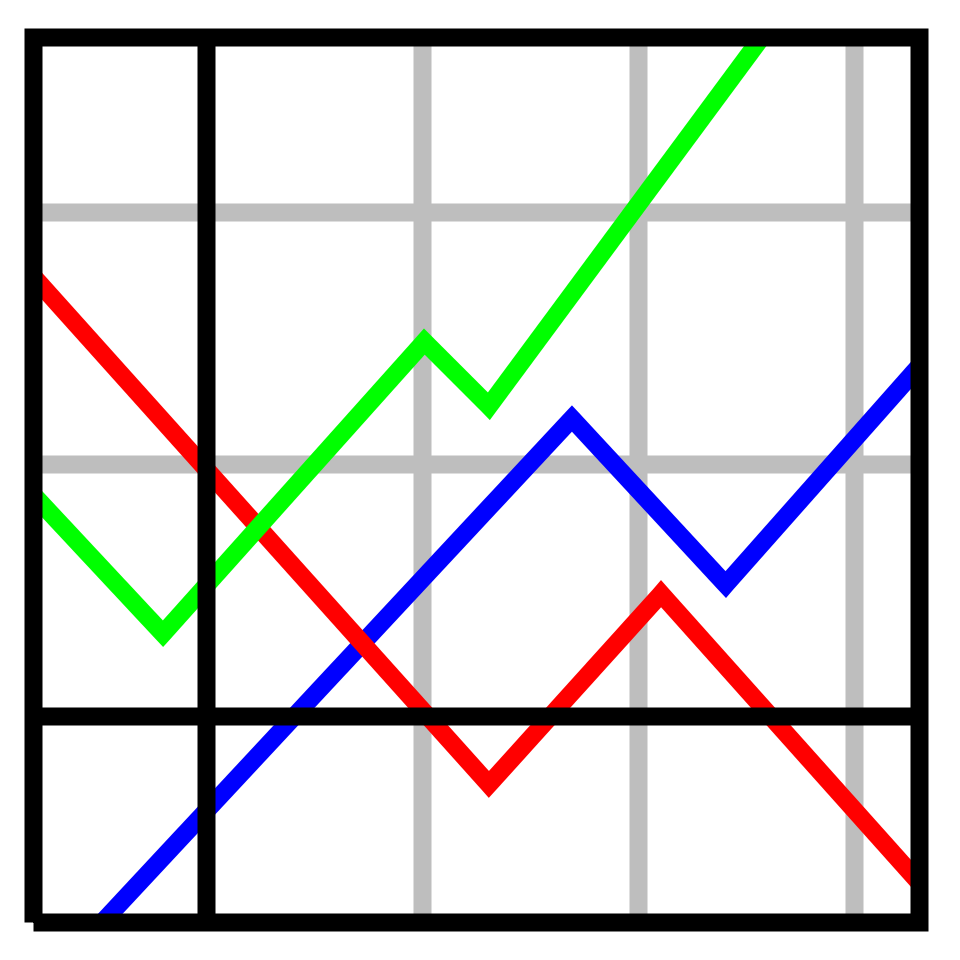

# animate-gnuplot-icon
"animate-gnuplot-icon" generates a **gnuplot icon image and animation** using linear function fitting with the `fit` command.

# DEMO
|||
|---|---|
|Animation (PNG images → GIF)|Image (PNG)|

# Features
- You can get a gnuplot icon image and animation by running this code.
This code execute plot command in two type of terminals: `qt` / `pngcairo`.
- To plot graphs (<span style="color: red; ">red</span> / <span style="color: green; ">green</span> / <span style="color: blue; ">blue</span>), this program requires [`pos_break_point.txt`](pos_break_point.txt).
This file saves the coordinates of the break points of each graph.
- The number of sample points in [`pos_break_point.txt`](pos_break_point.txt) was not enough to create an animation.
So I use **fitting** to automatically find the slope and intercept of the three or four linear functions in each graph. The calculated parameters will be saved in [`fitting_parameter.txt`](data/fitting_parameter.txt) .


# Operating environment
<!-- # Requirement -->
- macOS Big Sur 11.5 / Macbook Air (M1, 2020) 16GB
- gnuplot version 5.4 patchlevel 2
- VScode 1.58.2
- FFmpeg 4.4

<!-- # Installation -->

# Usage
```
git clone https://github.com/hiroloquy/animate-gnuplot-icon.git
cd animate-gnuplot-icon
gnuplot
load 'animate_gnuplot_icon.plt'
```

# Note
- The data in [`pos_break_point.txt`](pos_break_point.txt) are measured values, not true values.

- I made a MP4 file (demo.mp4) and an animated GIF (demo.gif) by using **FFmpeg**.
```
cd animate-gnuplot-icon

# MP4
ffmpeg -framerate 60 -i png/img_%04d.png -vcodec libx264 -pix_fmt yuv420p -vf "scale=trunc(iw/2)*2:trunc(ih/2)*2" -r 60 demo.mp4

# GIF
ffmpeg -i demo.mp4 -filter_complex "[0:v] fps=30,split [a][b];[a] palettegen [p];[b][p] paletteuse" demo.gif
```

- To display the outer border, not only `border` but also `set object ... rectangle` is executed. This is because they each lack a different corner when the width of the line is thick; i.e., the value of `linewidth` (`lw`) is large.
  - If you only run the command `border`, this program outputs the PNG images missing upper left corner.
  - On the other hand, you get outputted images missing lower left corner with running only `set object ... rectangle`.
  - So, drawing the border works well with combining these commands.  

||||
|---|---|---|
|Only `border` (missing upper left corner)|Only `rectangle` (missing lower left corner)|`border` + `rectangle`|

# Author
* Hiro Shigeyoshi
* Twitter: https://twitter.com/hiroloquy
 
# License
"animate-gnuplot-icon" is under [Hiroloquy](https://hiroloquy.com/).
 